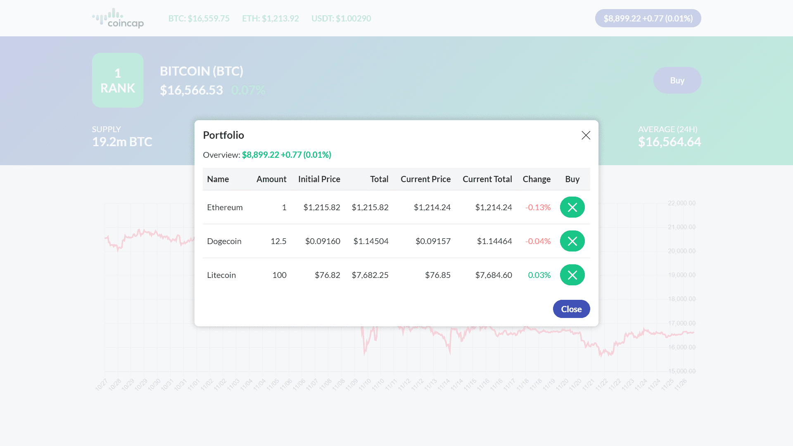

# **Hiya**!

This is a project I created as a test assignment.

Here you can see information about cryptocurrencies and their price chart. You can also "buy" cryptocurrencies (add them to your portfolio, which is in localStorage). After that, you will be able to track changes in the prices of your portfolio!

### Application stack
React.js, Remix, styled-components, Chart.js.

### Some screenshot of the project

### Post Scriptum ###

Unfortunately, to "touch" the project you need to download it and run on your machine (SSR!), because I do not want to waste Heroku dynos on this (especially after it became paid).

### How to run ###

`npm i`

`npm run dev`
